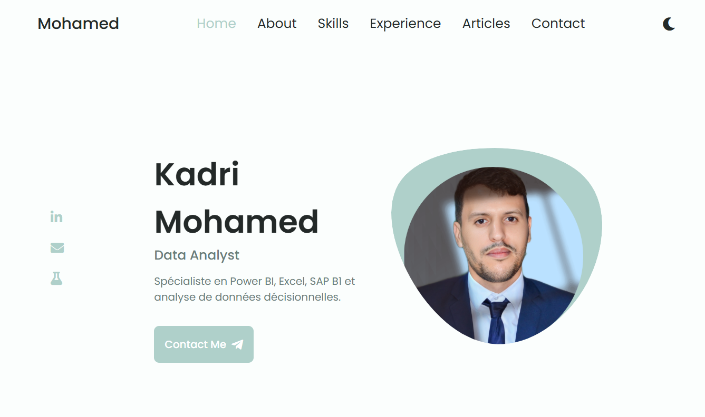

# Kadri Mohamed | Portfolio

<p align="center">
  <span style="font-size: larger;">Portfolio personnel — Contrôleur de Gestion & Data Analyst</span>
</p>

<div align="center">
  
  
  
</div>

<p align="center">
  📍 <a href="#">Voir le site en ligne</a> ·
  💼 <a href="https://www.linkedin.com/in/kadrimohamed/">LinkedIn</a> ·
  ✉️ <a href="mailto:kadrimed95@gmail.com">Contact</a>
</p>

---

## Sommaire

- [À propos](#à-propos)
- [Aperçu](#aperçu)
- [Fonctionnalités](#fonctionnalités)
- [Stack technique](#stack-technique)
- [Structure du projet](#structure-du-projet)
- [Installation locale](#installation-locale)
- [Projets Data / Power BI](#projets-data--power-bi)
- [Crédits](#crédits)
- [Licence](#licence)

---

## À propos

Ce dépôt contient le code source de mon portfolio personnel, présentant mon profil de **Contrôleur de Gestion / Data Analyst** : parcours, compétences, expériences professionnelles et projets Power BI.

L'objectif : offrir une vitrine claire et rapide à consulter pour les recruteurs, avec un accès direct à mon CV et à mes réalisations en Business Intelligence.

## Aperçu

<p align="center">
  
</p>

*(Remplacer l'image ci-dessus par une capture d'écran à jour du site, à placer dans `assets/screenshots/`.)*

## Fonctionnalités

- **Accueil** — présentation rapide et liens sociaux (LinkedIn, e-mail, GitHub)
- **À propos** — résumé de profil et téléchargement du CV
- **Compétences** — Power BI, Excel, SQL, SAP Business One, Python, langues
- **Expérience** — parcours académique et professionnel sous forme de timeline interactive
- **Contact** — formulaire d'envoi de message (EmailJS) + coordonnées directes
- **Thème clair / sombre** — bouton de bascule day/night
- **Responsive** — adapté mobile, tablette et desktop

## Stack technique

| Catégorie   | Technologies |
|-------------|--------------|
| Structure   | HTML5 |
| Style       | SCSS / CSS3 |
| Interactivité | JavaScript, Swiper.js |
| Formulaire de contact | EmailJS |
| Icônes      | Font Awesome |

## Structure du projet

```
kadri-mohamed/
├── assets/         # CV, favicons, captures d'écran
├── css/            # Feuilles de style compilées
├── scss/           # Sources Sass
├── img/            # Images du site
├── js/             # Scripts (menu, thème, swiper, formulaire)
├── index.html      # Page principale
├── robots.txt
├── sitemap.xml
└── LICENSE.txt
```

## Installation locale

```bash
git clone https://github.com/KADRIMOHAMED/kadri-mohamed.git
cd kadri-mohamed
```

Aucune dépendance à installer : ouvrir directement `index.html` dans un navigateur, ou servir le dossier avec une extension type *Live Server* pour le rechargement automatique pendant les modifications SCSS.

## Projets Data / Power BI

Ce portfolio met en avant mon profil, mais mes réalisations en Business Intelligence (dashboards Power BI, reporting SAP B1, challenges FP20/ZoomCharts) sont présentées séparément :

- 🔗 *Lien à ajouter vers mes dashboards / repos Power BI*

## Crédits

Le gabarit initial de ce site (structure HTML/SCSS et interactions) est basé sur le portfolio open-source de **Judit Lázaro Moyano** ([@JuditKaramazov](https://github.com/JuditKaramazov)). Le contenu, les textes et les données présentés ont été entièrement remplacés par mes informations personnelles.

## Licence

Distribué sous licence MIT — voir [LICENSE.txt](LICENSE.txt) pour plus de détails.

---

<p align="center">
  Fait avec 📊 par <a href="https://www.linkedin.com/in/kadrimohamed/">Kadri Mohamed</a>
</p>
